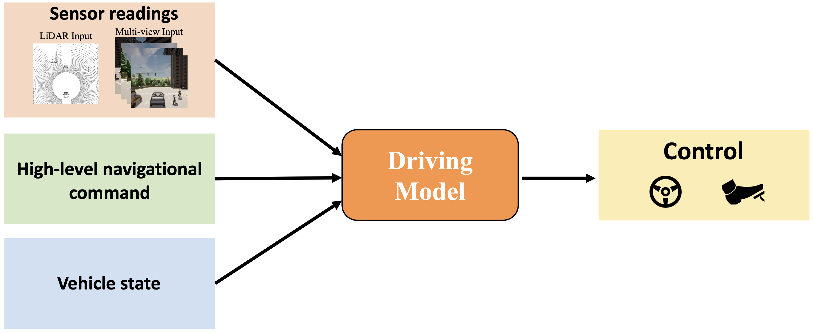

# Awesome End-to-End Autonomous Driving

This is a collection of research papers for **End-to-End Autonomous driving**.
And the repository will be continuously updated to track the latest update of E2E driving.

Welcome to follow and star!

## Table of Contents

- [A Overview of End-to-End Driving Method](#a-Overview-of-End-to-End-Driving-Method)
- [Papers](#papers)

  - [CVPR 2023](#CVPR-2023) 
  - [ECCV 2022](#ECCV-2022) 
  - [ICLR 2022](#ICLR-2022) 
  - [CVPR 2022](#CVPR-2022) 
  - [CVPR 2021](#CVPR-2021) 
  - [CVPR 2020](#CVPR-2020) 
  - [ICCV 2021](#ICCV-2021) 
  - [NeurIPS 2022](#NeurIPS-2022) 
  - [CoRL 2022](#CoRL-2022) 
  - [CoRL 2021](#CoRL-2021) 
  - [T-PAMI](#T-PAMI) 
  - [Arxiv](#arxiv)
  - [Others](#others)
- [Contributing](#contributing)


## An Overview of End-to-End Driving Method

The end-to-end driving methods aim at building a drive model that at each timestamp maps sensor readings (RGB & LiDAR), high-level navigational command, and vehicle state to raw control command. The raw control command usually includes steering, throttle and brake. Based on the command, the autonomous vehicle can drive from the start point to the goal point without collisions and violation of traffic rules. The traditional modular pipeline uses many independent modules, such as preception, localizition, scene understanding, behaviour prediction and path planing, etc. Each of these modules is designed, trained and evaluted for its own purpose. In contrast, the end-to-end methods go from the sensor input to the raw control, skipping everything in between. Most of the works are realized on the CARLA which is an open-source urban simulator for autonomous driving research. The simulator provides open digital assets (urban layouts, buildings, vehicles) that were created for this purpose ,and supports flexible specification of sensor suites and environmental conditions.  The other simulators include [Sumo](https://www.eclipse.org/sumo/) , [MetaDrive](https://github.com/metadriverse/metadrive) and [SMARTS](https://simfactor.pour-offer/driver-training-solutions/smart-simulator/?lang=en) . 

The recent end-to-end driving methods can be divided into two mainstreams: imitation learning and reinforcement learning. Reinforcement learning (RL) is one of the most interesting areas of machine learning, where an agent interacts with an environment by following a policy. In each state of the environment, it takes action based on the policy, and as a result, receives a reward and transitions to a new state. The goal of RL is to learn an optimal policy which maximizes the long-term cumulative rewards.  In imitation learning instead of trying to learn from the sparse rewards or manually specifying a reward function, an expert (typically a human) provides us with a set of demonstrations. The agent then tries to learn the optimal policy by following, imitating the expert’s decisions.




## Papers

```
format:
- [title](paper link) [links]
  - author1, author2, and author3.
  - key 
  - experiment environment
```

### NEWs

- [Hidden Biases of End-to-End Driving Models](https://arxiv.org/abs/2306.07957)
  	- Bernhard Jaeger, Kashyap Chitta, Andreas Geiger
  	- ICCV 2023
 
- [End-to-End Autonomous Driving: Challenges and Frontiers](https://github.com/OpenDriveLab/End-to-end-Autonomous-Driving/blob/main)
	- Li Chen, Penghao Wu, Kashyap Chitta, Bernhard Jaeger, Andreas Geiger, Hongyang Li
   	- Survey, arXiv

- [Efficient Reinforcement Learning for Autonomous Driving with Parameterized Skills and Priors](https://arxiv.org/abs/2305.04412)
  	- Letian Wang, Jie Liu, Hao Shao, Wenshuo Wang, Ruobing Chen, Yu Liu, Steven L. Waslander
  	- RSS 2023
   

### CVPR 2023
- [ReasonNet: End-to-End Driving with Temporal and Global Reasoning](https://arxiv.org/abs/2305.10507) (**<font color="red">Ours!!!</font>**)
	- Hao Shao, Letian Wang, Ruobing Chen, Steven L. Waslander, Hongsheng Li, Yu Liu
	- Key: temporal reasoning, global reasoning, memory bank, occupancy prediction
	- Env: [CARLA](https://carla.org/)
	
- [ThinkTwice: A SOTA Decoder for End-to-End Autonomous Driving under BEV](https://arxiv.org/abs/2305.06242)
	- Xiaosong Jia, Penghao Wu, Li Chen, Jiangwei Xie, Conghui He, Junchi Yan, Hongyang Li
	- Key: coarse-to-fine prediction, bev, cascaded framework
	- Env: [CARLA](https://carla.org/)

- [Planning-oriented Autonomous Driving](https://arxiv.org/abs/2212.10156)
	- Yihan Hu, Jiazhi Yang, Li Chen, Keyu Li, Chonghao Sima, Xizhou Zhu, Siqi Chai, Senyao Du, Tianwei Lin, Wenhai Wang, Lewei Lu, Xiaosong Jia, Qiang Liu, Jifeng Dai, Yu Qiao, Hongyang Li
	- Key: full-stack tasks, unified model, feature abstraction
	- Env: [CARLA](https://carla.org/), nuScenes

### ECCV 2022
- [KING: Generating Safety-Critical Driving Scenarios for Robust Imitation via Kinematics Gradients](https://arxiv.org/abs/2204.13683)
	- Niklas Hanselmann, Katrin Renz, Kashyap Chitta, Apratim Bhattacharyya, Andreas Geiger
	- Key: scenarios generation, proxy model, optimization 
	- Env: [CARLA](https://carla.org/)
- [Learning to Drive by Watching YouTube Videos: Action-Conditioned Contrastive Policy Pretraining](https://arxiv.org/pdf/2204.02393.pdf)
	- Qihang Zhang, Zhenghao Peng, and Bolei Zhou
	- Key: learning from unlabeled data, feature pretraining
	- Env: [CARLA](https://carla.org/)

### ICLR 2022
- [Efficient Learning of Safe Driving Policy via Human-AI Copilot Optimization](https://arxiv.org/abs/2202.10341)
	- Quanyi Li, Zhenghao Peng, Bolei Zhou
	- Key: human intervention, safety, demonstration
	- Env: [MetaDrive](https://github.com/metadriverse/metadrive)

### CVPR 2022
- [Learning from All Vehicles](https://arxiv.org/abs/2203.11934)
	- Dian Chen, Philipp Krähenbühl
	- Key: supervisory task, viewpoint invariant intermediate representation
	- Env: [CARLA](https://carla.org/)
- [COOPERNAUT: End-to-End Driving with Cooperative Perception for Networked Vehicles](https://arxiv.org/abs/2205.02222)
	- Jiaxun Cui, Hang Qiu, Dian Chen, Peter Stone, Yuke Zhu
	- Key: cooperative driving, cross-vehicle perception, communication
	- Env: [CARLA](https://carla.org/) , [AUTOCASTSIM](https://github.com/hangqiu/AutoCastSim)


### CVPR 2021
- [Multi-Modal Fusion Transformer for End-to-End Autonomous Driving](https://arxiv.org/abs/2104.09224)
	- Aditya Prakash, Kashyap Chitta, Andreas Geiger
	- Key: multi-modal fusion, transformer, imitation learning
	- Env: [CARLA](https://carla.org/)
- [Learning by Watching](https://arxiv.org/abs/2106.05966)
	- Jimuyang Zhang, Eshed Ohn-Bar
	- Key: imitation learning,  demonstration, intermediate representation
	- Env: [CARLA](https://carla.org/)


### CVPR 2020
- [Learning situational driving](https://openaccess.thecvf.com/content_CVPR_2020/papers/Ohn-Bar_Learning_Situational_Driving_CVPR_2020_paper.pdf)
	- Eshed Ohn-Bar, Aditya Prakash, Aseem Behl, Kashyap Chitta, Andreas Geiger
	- Key: situational driving policy, mixture model, behavior cloning
	- Env: [CARLA](https://carla.org/)
- [Exploring the Limitations of Behavior Cloning for Autonomous Driving](https://arxiv.org/abs/1904.08980)
	- Felipe Codevilla, Eder Santana, Antonio M. López, Adrien Gaidon
	- Key: behavior cloning, visuomotor policy, driving benchmark
	- Env: [CARLA](https://carla.org/)
- [End-to-End Model-Free Reinforcement Learning for Urban Driving using Implicit Affordances](https://arxiv.org/abs/1911.10868)
	- Marin Toromanoff, Emilie Wirbel, Fabien Moutarde
	- Key: implicit affordance, reinforcement learning, data efficiency
	- Env: [CARLA](https://carla.org/) , [TORCS](https://sourceforge.net/projects/torcs/)

### ICCV 2021
- [End-to-End Urban Driving by Imitating a Reinforcement Learning Coach](https://arxiv.org/abs/2108.08265)
	- Zhejun Zhang, Alexander Liniger, Dengxin Dai, Fisher Yu, Luc Van Gool
	- Key: imitation learning, reinforcement learning
	- Env: [CARLA](https://carla.org/)
- [NEAT: Neural Attention Fields for End-to-End Autonomous Driving](https://arxiv.org/abs/2109.04456)
	- Key: attention map, iterative generation, auxiliary semantics
	- Env: [CARLA](https://carla.org/)
- [Learning to drive from a world on rails](https://arxiv.org/abs/2105.00636)
	- Dian Chen, Vladlen Koltun, Philipp Krähenbühl
	- Key: model-based, offline reinforcement learning, policy distillation
	- Env: [CARLA](https://carla.org/)


### NeurIPS 2022
- [Trajectory-guided Control Prediction for End-to-end Autonomous Driving: A Simple yet Strong Baseline](https://arxiv.org/abs/2206.08129)
	- Penghao Wu, Xiaosong Jia, Li Chen, Junchi Yan, Hongyang Li, Yu Qiao
	- Key: multi-step prediction, trajectory guidance, connected branches
	- Env: [CARLA](https://carla.org/)

### CoRL 2022
- [Safety-Enhanced Autonomous Driving Using  Interpretable Sensor Fusion Transformer](https://arxiv.org/abs/2207.14024) (**<font color="red">Ours!!!</font>**)
	- Hao Shao, Letian Wang, RuoBing Chen, Hongsheng Li, Yu Liu
	- Key: autonomous driving, sensor fusion, transformer, safety
	- Env: [CARLA](https://carla.org/)
- [PlanT: Explainable Planning Transformers via Object-Level Representations](https://arxiv.org/abs/2210.14222)
	- Katrin Renz, Kashyap Chitta, Otniel-Bogdan Mercea, A. Sophia Koepke, Zeynep Akata, Andreas Geiger
	- Key: autonomous Driving, transformers, explainability
	- Env: [CARLA](https://carla.org/)

### CoRL 2020
- [Learning by cheating](https://arxiv.org/abs/1912.12294)
	- Dian Chen, Brady Zhou, Vladlen Koltun, Philipp Krähenbühl
	- Key:  imitation learning, sensorimotor control
	- Env: [CARLA](https://carla.org/)
- [SAM: Squeeze-and-Mimic Networks for Conditional Visual Driving Policy Learning](https://arxiv.org/abs/1912.02973)
	- Albert Zhao, Tong He, Yitao Liang, Haibin Huang, Guy Van den Broeck, Stefano Soatto
	- Key: conditional imitation learning, side task
	- Env: [CARLA](https://carla.org/)


### T-PAMI
- [MetaDrive: Composing Diverse Driving Scenarios for Generalizable Reinforcement Learning](https://arxiv.org/abs/2109.12674)
	- Quanyi Li, Zhenghao Peng, Lan Feng, Qihang Zhang, Zhenghai Xue, Bolei Zhou
	- Key : reinforcement learning, procedural generation, real data import
	- Env: [MetaDrive](https://github.com/metadriverse/metadrive)
- [TransFuser: Imitation with Transformer-Based Sensor Fusion for Autonomous Driving](https://arxiv.org/abs/2205.15997)
	- Kashyap Chitta, Aditya Prakash, Bernhard Jaeger, Zehao Yu, Katrin Renz, Andreas Geiger
	- Key: imitation learning, sensor fusion, transformers, attention
	- Env: [CARLA](https://carla.org/)

### arXiv
- [GRI: General Reinforced Imitation and its Application to Vision-Based Autonomous Driving](https://arxiv.org/abs/2111.08575)
	- Raphael Chekroun, Marin Toromanoff, Sascha Hornauer, Fabien Moutarde
	- Key: demonstration, multi-view input, offline learning
	- Env: [CARLA](https://carla.org/)
- [Nocturne: a scalable driving benchmark for bringing multi-agent learning one step closer to the real world](https://arxiv.org/abs/2206.09889)
	- Eugene Vinitsky, Nathan Lichtlé, Xiaomeng Yang, Brandon Amos, Jakob Foerster
	- Key: high-speed simulator, obstruction, complex scene
	- Env: [Nocturne](https://github.com/facebookresearch/nocturne)
- [Accelerating Reinforcement Learning for Autonomous Driving using Task-Agnostic and Ego-Centric Motion Skills](https://arxiv.org/abs/2209.12072) (**<font color="red">Ours!!!</font>**)
	- Tong Zhou, Letian Wang, Ruobing Chen, Wenshuo Wang, Yu Liu
	- Key: reinforcement learning, exploration, motion primitive
	- Env: [MetaDrive](https://github.com/metadriverse/metadrive)
- [ChauffeurNet: Learning to Drive by Imitating the Best and Synthesizing the Worst](https://arxiv.org/abs/1812.03079)
    - Mayank Bansal, Alex Krizhevsky, Abhijit Ogale
    - Key: imitation learning, synthesized data, mid-level representation
    - Env: Offline replays
- [Learning to Drive in a Day](https://arxiv.org/abs/1807.00412)
    - Alex Kendall, Jeffrey Hawke, David Janz, Przemyslaw Mazur, Daniele Reda, John-Mark Allen, Vinh-Dieu Lam, Alex Bewley, Amar Shah
    - Key: reinforcement learning, model-free, efficiency
    - Env: Private driving simulator, Real-world driving

### Others
- [End-to-end Learning of Driving Models from Large-scale Video Datasets](https://arxiv.org/abs/1807.00412)
    - Huazhe Xu, Yang Gao, Fisher Yu, Trevor Darrell
    - Key: multi-modal, imitation learning, large-scale video dataset 
    - Env: The Berkeley DeepDrive Video Dataset
- [Explaining Autonomous Driving by Learning End-to-End Visual Attention](https://arxiv.org/abs/2006.03347)
    - Luca Cultrera, Lorenzo Seidenari, Federico Becattini, Pietro Pala, Alberto Del Bimbo
    - Key: reinforcement learning, attention, multi-head network
    - Env: [CARLA](https://carla.org/)
- [Multimodal End-to-End Autonomous Driving](https://arxiv.org/abs/1906.03199)
    - Yi Xiao, Felipe Codevilla, Akhil Gurram, Onay Urfalioglu, Antonio M. López
    - Key: multi-modal, modular pipeline
    - Env: [CARLA](https://carla.org/)
- [Driving in Dense Traffic with Model-Free Reinforcement Learning](ihttps://arxiv.org/abs/1909.06710)
    - Dhruv Mauria Saxena, Sangjae Bae, Alireza Nakhaei, Kikuo Fujimura, Maxim Likhachev
    - Key: reinforcement learning, model free, dense traffic
    - Env: [Automotive Driving Models](https://github.com/sisl/AutomotiveDrivingModels.jl/)
- [Urban Driving with Conditional Imitation Learning](https://arxiv.org/abs/1912.00177) 
    - Jeffrey Hawke, Richard Shen, Corina Gurau, Siddharth Sharma, Daniele Reda, Nikolay Nikolov, Przemyslaw Mazur, Sean Micklethwaite, Nicolas Griffiths, Amar Shah, Alex Kendall
    - Key: imitation learning, representation learning, conditional branch
    - Env: Real-world driving
- [FlowDriveNet: An End-to-End Network for Learning Driving Policies from Image Optical Flow and LiDAR Point Flow](https://shuai-wang.netlify.app/files/FlowDriveNet.pdf)
    - Shuai Wang, Jiahu Qin, Menglin Li and Yaonan Wang
    - Key: optical flow, lidar flow, temporal fusion
    - Env: CH2-LiDAR dataset
- [Grounding Human-to-Vehicle Advice for Self-driving Vehicles](https://arxiv.org/abs/1911.06978) 
    - Jinkyu Kim, Teruhisa Misu, Yi-Ting Chen, Ashish Tawari, John Canny
    - Key: natural language advice, attention
    - Env: Honda Research Institute-Advice Dataset (HAD)
- [Learning Interpretable End-to-End Vision-Based Motion Planning for Autonomous Driving with Optical Flow Distillation](https://arxiv.org/abs/2104.12861)
    - Hengli Wang, Peide Cai, Yuxiang Sun, Lujia Wang, Ming Liu
    - Key: interpretable, optical flow, distillation
    - Env: nuScenes, [CARLA](https://carla.org/)
- [Learning a Decision Module by Imitating Driver’s Control Behaviors Junning](https://arxiv.org/abs/1912.00191)
    - Junning Huang, Sirui Xie, Jiankai Sun, Qiurui Ma, Chunxiao Liu, Jianping Shi, Dahua Lin, Bolei Zhou
    - Key: hybrid framework, imitation learning, safety driving
    - Env: [CARLA](https://carla.org/)

## Contributing
Our purpose is to make this repo even better. If you are interested in contributing, please refer to [HERE](CONTRIBUTING.md) for instructions in contribution.

## License
Awesome End-to-End Autonomous driving is released under the Apache 2.0 license.
